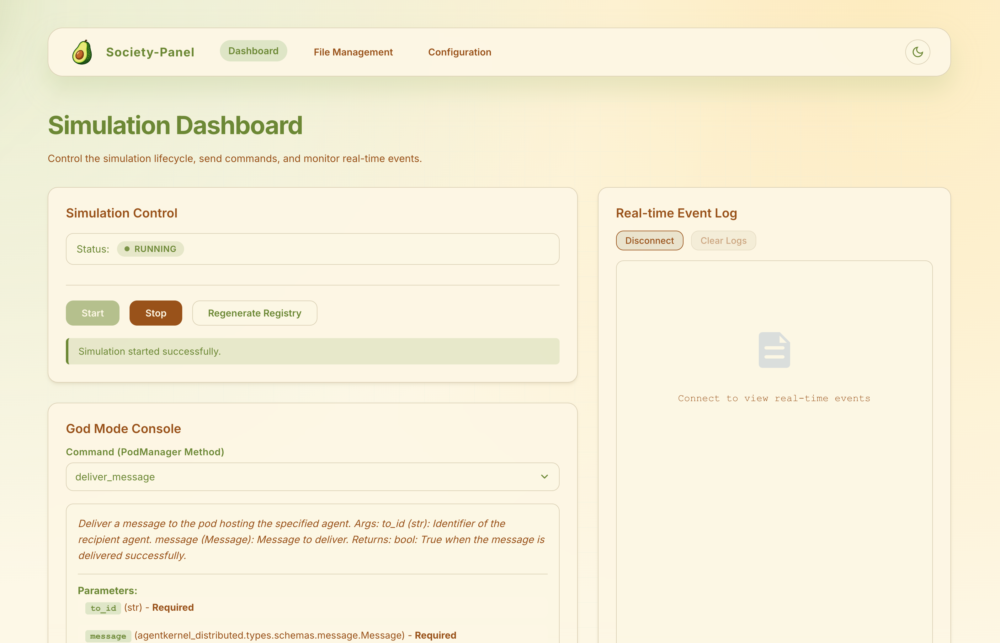
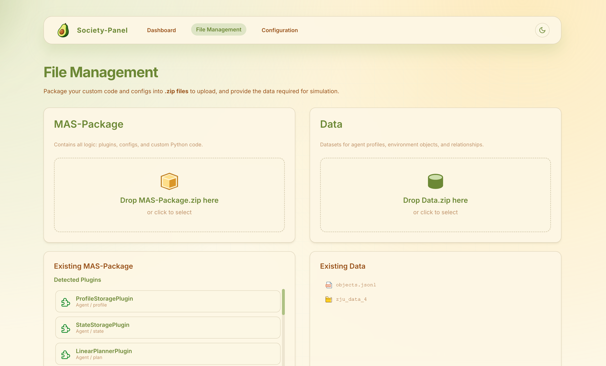
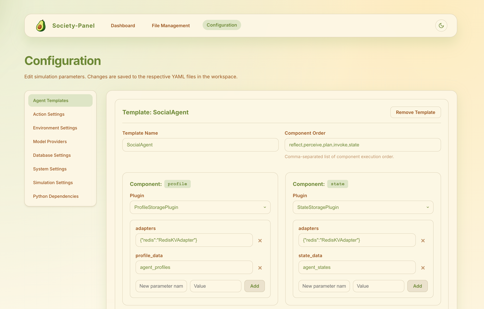

# Society Panel

A unified visual control panel for Multi-Agent System (MAS) simulations. Society Panel integrates simulation management, file operations, and configuration editing into a single web-based interface, enabling researchers and developers to build, deploy, and monitor agent societies with ease.

---

## 📑 Table of Contents

- [✨ Feature Overview](#-feature-overview)
  - [One-Click Simulation Launch](#one-click-simulation-launch)
  - [Global Command Console](#global-command-console)
  - [Event Stream Visualization](#event-stream-visualization)
- [🖥️ Interface Introduction](#️-interface-introduction)
  - [Dashboard](#dashboard)
  - [File Management](#file-management)
  - [Configuration Center](#configuration-center)
- [🚀 Quick Start](#-quick-start)
  - [Step 1: Prepare Your Simulation Assets](#step-1-prepare-your-simulation-assets)
  - [Step 2: Upload Files](#step-2-upload-files)
  - [Step 3: Verify Configuration](#step-3-verify-configuration)
  - [Step 4: Start Simulation](#step-4-start-simulation)
  - [Step 5: Interact & Observe](#step-5-interact--observe)
- [❓ FAQ](#-faq)
- [📁 Project Structure](#-project-structure)
- [🛠️ Development](#️-development)
  - [Prerequisites](#prerequisites)
  - [Running Locally](#running-locally)
- [📄 License](#-license)

---

## ✨ Feature Overview

### One-Click Simulation Launch
Visually configure and launch agent society simulations with portable setup and execution.

### Global Command Console
Send commands and debug behaviors from a "God Mode" perspective to streamline strategy experiments.

### Event Stream Visualization
Aggregates real-time logs and key events to facilitate rapid troubleshooting of behavior and performance issues.

---

## 🖥️ Interface Introduction

The panel integrates three workspaces into a unified interface, supporting one-stop operations for building, uploading, and configuration.

### Dashboard



Centralizes simulation status display, quick controls, and real-time log streams.

- One-click execution of core operations like **Start / Stop / Regenerate Registry**
- God Mode Console debugging commands take effect in real-time
- Continuous scrolling of real-time event logs assists in tracking agent behavior

---

### File Management



Uploads the MAS-Package and datasets required for simulation with one-click import.

- Supports upload and automatic extraction of plugin, config, and script packages
- Datasets are uniformly stored in `workspace/data` for version management
- Automatically generates `registry.py` after upload, eliminating manual resource imports

---

### Configuration Center



Enables visual editing of YAML configurations for convenient management.

- Left-side file navigation allows for quick configuration switching
- Form-based editing prevents syntax errors
- Auto-save functionality writes changes back to the corresponding file in `workspace/configs`

---

## 🚀 Quick Start

Follow the standard process from preparing assets to starting the simulation to ensure the success of your first experiment.

### Step 1: Prepare Your Simulation Assets

Package plugins, configs, and data into `MAS-Package.zip` and `Data.zip`.

```
MAS-Package.zip
├── plugins/
│   ├── action/
│   ├── agent/
│   └── environment/
├── configs/
│   ├── agents_config.yaml
│   ├── simulation_config.yaml
│   └── ...
├── custom_controller.py (optional)
├── custom_pod_manager.py (optional)
└── custom_folder/ (optional)

Data.zip
└── your_dataset/
    ├── agent/
    ├── map/
    ├── relation/
    └── ...
```

### Step 2: Upload Files

Upload the MAS-Package and Data on the **File Management** page and confirm successful recognition.

### Step 3: Verify Configuration

Add or modify configurations in the **Configuration Center** to ensure files meet requirements.

### Step 4: Start Simulation

Return to the **Dashboard**, click the **Start** button, and observe the status indicator and log output.

### Step 5: Interact & Observe

Send commands via the **God Mode Console** or monitor agent behaviors in the logs.

---

## ❓ FAQ

When encountering errors, check these scenarios first to quickly identify the root cause.

### What should I do if an error occurs after clicking Start?

Verify that the startup script output and config file match the current service address. Common causes include unready dependency containers or YAML path errors.

### Why can't I see the new plugin in the config page after upload?

Confirm the plugin inherits from the correct framework base class and that the MAS-Package upload succeeded. If necessary, manually execute **"Regenerate Registry"** in the Dashboard.

### What if the port is already in use?

Modify `FRONTEND_PORT` and `BACKEND_PORT` in `scripts/start_society_panel.sh` (or `.bat` for Windows), or adjust the port mapping in Docker Compose.

---

## 📁 Project Structure

```
society-panel/
├── assets/                 # Documentation images
├── backend/                # FastAPI backend service
│   ├── app/
│   │   ├── api/            # API endpoints
│   │   ├── services/       # Business logic
│   │   └── main.py         # Application entry
│   ├── workspace/          # Runtime workspace
│   └── requirements.txt
└── frontend/               # Vue 3 + Vite frontend
    ├── src/
    │   ├── components/     # UI components
    │   ├── views/          # Page views
    │   ├── stores/         # Pinia state management
    │   └── router/         # Vue Router config
    └── package.json
```

---

## 🛠️ Development

### Prerequisites

- Python 3.11+
- Node.js 18+
- npm or pnpm

### Running Locally

From the project root directory:

```bash
# macOS / Linux
./scripts/start_society_panel.sh

# Windows
scripts\start_society_panel.bat
```

The script will automatically:
1. Create Python virtual environment and install dependencies
2. Install npm packages for the frontend
3. Start both backend (port 8001) and frontend (port 5174) services

Access the panel at: **http://localhost:5174**

---

## 📄 License

This project is part of the AgentKernel framework. See the root [LICENSE](../LICENSE) file for details.

